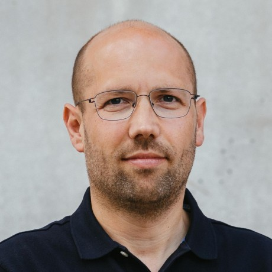
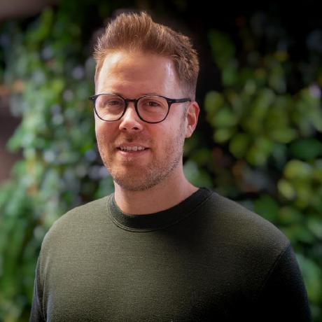
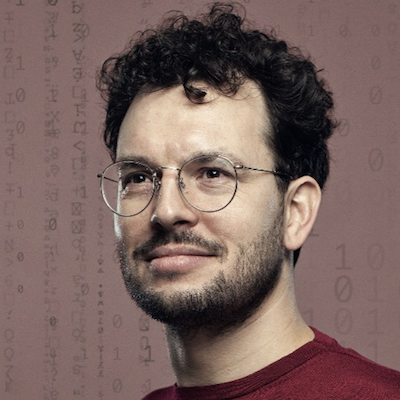
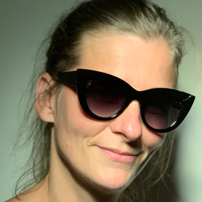
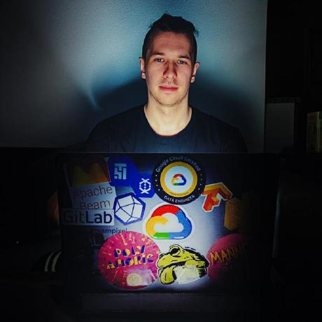

# Our Team

<!-- markdownlint-disable MD030 MD033 -->

-   ## Robbert Bos

    Product Owner

    ----

    {: .round }

    Robbert has been on a mission for over 15 years to enhance the transparency and collaboration within AI projects.
    Before joining this team, he founded several data science and tech companies (partly) dedicated to this cause.
    Robbert is passionate about solving complex problems where he connects business needs with technology and involves
    others in how these solutions can improve their work.

    [:fontawesome-brands-github: robbertbos](https://github.com/robbertbos)

    [:fontawesome-brands-linkedin: Robbert Bos](https://www.linkedin.com/in/robbertbos/)

-   ## Lucas Haitsma

    Researcher in Residence

    ----

    {: .round }

    Lucas is PhD candidate conducting research into the regulation and governance of algorithmic discrimination by
    supervision and enforcement organizations.

    [:fontawesome-brands-linkedin: Lucas Haitsma](https://www.linkedin.com/in/lucas-h-779375139/)

    [:octicons-link-24: rug.nl](https://www.rug.nl/staff/l.m.haitsma/?lang=en)

-   ## Berry den Hartog

    Engineer

    ----

    {: .round }

    Berry is a software engineer passionate about problem-solving and system optimization, with expertise in Go,
    Python, and C++. Specialized in architecting high-volume data processing systems and implementing Lean-Agile and
    DevOps practices. Experienced in managing end-to-end processes from hardware provisioning to software deployment
    and release.

    [:fontawesome-brands-github: berrydenhartog](https://github.com/berrydenhartog)

    [:fontawesome-brands-linkedin: Berry den Hartog](https://www.linkedin.com/in/berry-denhartog)

-   ## Anne Schuth

    Engineering Manager

    ----

    {: .round }

    Anne used to be a Machine Learning Engineering Manager at Spotify and previously held roles at DPG Media, Blendle,
    and Google AI. He holds a PhD from the University of Amsterdam.

    [:fontawesome-brands-github: anneschuth](https://github.com/anneschuth)

    [:fontawesome-brands-linkedin: Anne Schuth](https://linkedin.com/in/AnneSchuth)

    [:octicons-link-24: anneschuth.nl](https://anneschuth.nl)

-   ## Christopher Spelt

    Engineer

    ----

    {: .round }

    After graduating in pure mathematics Christopher transitioned into machine learning. He is passionate about solving complex problems, especially those that have a societal impact. My expertise lies in math, machine learning theory and i'm skilled in Python.

    [:fontawesome-brands-github: ChristopherSpelt](https://github.com/ChristopherSpelt)

    [:fontawesome-brands-linkedin: Christopher Spelt](https://www.linkedin.com/in/christopher-spelt-27b39357/)

-   ## Willy Tadema

    AI Ethics Lead

    ----

    {: .round }

    Willy specializes in data science, ethics-by-design, XAI, fairness in machine learning, ML model risk management,
    ML architecture, and MLOps. She's also skilled in R development, data integration, quality management, and geographic
    information systems (GIS).

    [:fontawesome-brands-github: FrieseWoudloper](https://github.com/FrieseWoudloper)

    [:fontawesome-brands-linkedin: Willy Tadema](https://www.linkedin.com/in/willytadema/)

-   ## Robbert Uittenbroek

    Engineer

    ----

    {: .round }

    Robbert is a highly enthusiastic full-stack engineer with a Bachelor's degree in Computer Science from the Hanze
    University of Applied Sciences in Groningen. He is passionate about building secure, compliant, and ethical
    solutions, and thrives in collaborative environments. Robbert is eager to leverage his skills and knowledge to
    help shape and propel the future of IT within the government.

    [:fontawesome-brands-github: uittenbroekrobbert](https://github.com/uittenbroekrobbert)

    [:fontawesome-brands-linkedin: Robbert Uittenbroek](https://www.linkedin.com/in/robbert-uittenbroek-48a215/)

-   ## Laurens Weijs

    Engineer

    ----

    {: .round }

    Laurens is a passionate guy with a love for innovation and doing things differently. With a background in
    Econometrics and Computer Science he loves to tackle the IT challenges of the Government by helping other people
    through extensive knowledge sharing on stage, building neural networks himself, or building a strong community.

    [:fontawesome-brands-github: laurensWe](https://github.com/laurensWe)

    [:fontawesome-brands-linkedin: Laurens Weijs](https://www.linkedin.com/in/laurensweijs)

