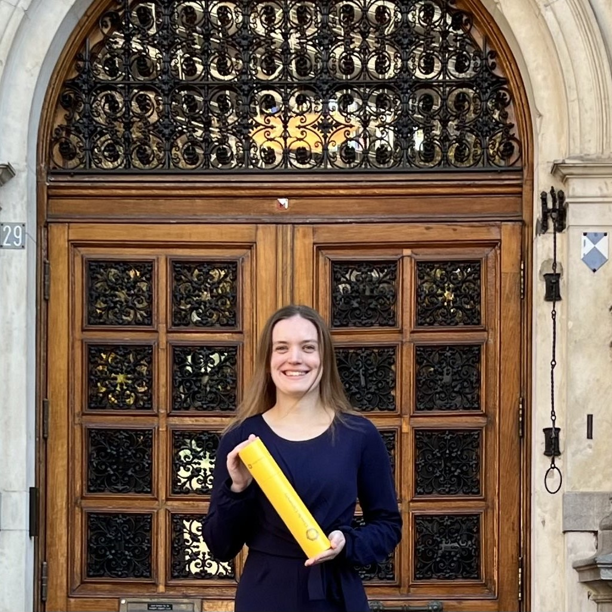

# Former team members

The AI Validation team operated from May 2024 through March 2025. Following this period, a dedicated smaller group
from the original team has continued to ensure the operation of our tools.

<!-- markdownlint-disable MD030 MD033 -->

-   ## Robbert Bos

    Product Owner

    ----

    {: .round }

    Robbert has been on a mission for over 15 years to enhance the transparency and collaboration within AI projects.
    Before joining this team, he founded several data science and tech companies (partly) dedicated to this cause.
    Robbert is passionate about solving complex problems where he connects business needs with technology and involves
    others in how these solutions can improve their work.

    [:fontawesome-brands-github: robbertbos](https://github.com/robbertbos)

    [:fontawesome-brands-linkedin: Robbert Bos](https://www.linkedin.com/in/robbertbos/)

-   ## Ravi Meijer

    Product Researcher

    ----

    {: .round }

    Ravi is an accomplished data scientist with expertise in machine learning, responsible AI, and the data science lifecycle.
    Her background in AI fuels her passion for solving complex problems and driving innovation for positive social impact.

    [:fontawesome-brands-github: ravimeijerrig](https://github.com/ravimeijerrig)

    [:fontawesome-brands-linkedin: Ravi Meijer](https://www.linkedin.com/in/ravi-meijer)

-   ## Christopher Spelt

    Engineer

    ----

    {: .round }

    After graduating in pure mathematics, Christopher transitioned into machine learning. He is passionate about
    solving complex problems, especially those that have a societal impact. My expertise lies in math, machine
    learning theory and I'm skilled in Python.

    [:fontawesome-brands-github: ChristopherSpelt](https://github.com/ChristopherSpelt)

    [:fontawesome-brands-linkedin: Christopher Spelt](https://www.linkedin.com/in/christopher-spelt-27b39357/)

-   ## Robbert Uittenbroek

    Engineer

    ----

    {: .round }

    Robbert is a highly enthusiastic full-stack engineer with a Bachelor's degree in Computer Science from the Hanze
    University of Applied Sciences in Groningen. He is passionate about building secure, compliant, and ethical
    solutions, and thrives in collaborative environments. Robbert is eager to leverage his skills and knowledge to
    help shape and propel the future of IT within the government.

    [:fontawesome-brands-github: uittenbroekrobbert](https://github.com/uittenbroekrobbert)

    [:fontawesome-brands-linkedin: Robbert Uittenbroek](https://www.linkedin.com/in/robbert-uittenbroek-48a215/)

-   ## Ruben Rouwhof

    UX/UI Designer

    ----

    {: .round }

    Ruben is a dedicated UX/UI Designer focused on crafting user-centric digital experiences. He is involved in projects
    from start to finish, covering user research, design, and technical implementation.

    [:fontawesome-brands-github: rubenrouwhof](https://github.com/rubenrouwhof)

    [:fontawesome-brands-linkedin: Ruben Rouwhof](https://www.linkedin.com/in/rubenrouwhof)

    [:octicons-link-24: rubenrouwhof.nl](https://rubenrouwhof.nl)

-   ### Renate Burema

     Intern

     ----

     {: .round }

     Renate is a master student Artificial Intelligence at Utrecht University.
     She is an intern writing her master thesis.
     Furthermore, she is passionate for the topics natural language processing and fairness.

     [:fontawesome-brands-linkedin: Renate Burema](https://linkedin.com/in/renate-burema-047b26211)

-   ## Anne Schuth

    Engineering Manager

    ----

    {: .round }

    Anne used to be a Machine Learning Engineering Manager at Spotify and previously held roles at DPG Media, Blendle,
    and Google AI. He holds a PhD from the University of Amsterdam.

    [:fontawesome-brands-github: anneschuth](https://github.com/anneschuth)

    [:fontawesome-brands-linkedin: Anne Schuth](https://linkedin.com/in/AnneSchuth)

    [:octicons-link-24: anneschuth.nl](https://anneschuth.nl)

-   ## Laurens Weijs

    Engineer

    ----

    {: .round }

    Laurens is a passionate guy with a love for innovation and doing things differently. With a background in
    Econometrics and Computer Science he loves to tackle the IT challenges of the Government by helping other people
    through extensive knowledge sharing on stage, building neural networks himself, or building a strong community.

    [:fontawesome-brands-github: laurensWe](https://github.com/laurensWe)

    [:fontawesome-brands-linkedin: Laurens Weijs](https://www.linkedin.com/in/laurensweijs)

-   ## Berry den Hartog

    Engineer

    ----

    {: .round }

    Berry is a software engineer passionate about problem-solving and system optimization, with expertise in Go,
    Python, and C++. Specialized in architecting high-volume data processing systems and implementing Lean-Agile and
    DevOps practices. Experienced in managing end-to-end processes from hardware provisioning to software deployment
    and release.

    [:fontawesome-brands-github: berrydenhartog](https://github.com/berrydenhartog)

    [:fontawesome-brands-linkedin: Berry den Hartog](https://www.linkedin.com/in/berry-denhartog)

-   ## Guusje Juijn

    Trainee

    ----

    {: .round }

    Guusje has a background in Artificial Intelligence, is experienced in Python and
    machine learning and has a strong interest in AI ethics.
    During her traineeship at the Dutch Government, she gained valuable experience in
    both a policy department and a software engineering team.

    [:fontawesome-brands-github: GuusjeJuijn](https://github.com/GuusjeJuijn)

    [:fontawesome-brands-linkedin: Guusje Juijn](https://www.linkedin.com/in/guusjejuijn)

